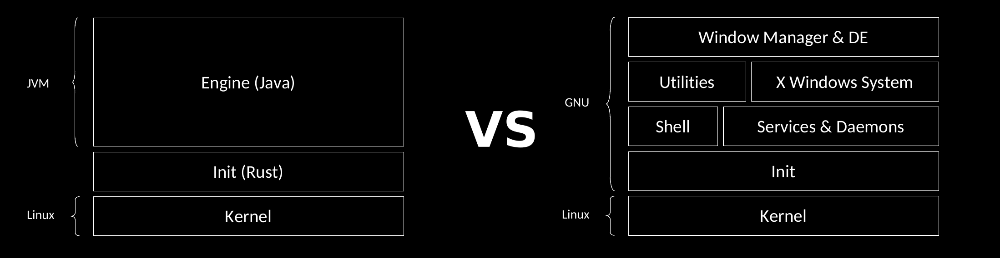

  

---
<h3 style="text-align: center">JVM/Linux Operating System</h2>
This is a new idea and the first version of Java-based operating system.    
This operating system is designed and implemented to run Java projects based on the `Java platform modular system (JPMS)`.   
In this operating system, there is no news of the `GNU` project anymore, and all control and management of the operating system is done through `Java`.    
The init program is rewritten with `rust` programming language.

  

Current Features : 
* Control environment variables
* Hostname
* Networking :
    * Activate/Deactivate interface
    * Flush interface
    * Set ip address
    * Routing
    * Define hosts and networks
* Backup system configuration
* Control date & time & timezone 
* NTP client
* Hardware Clock
* User management
* Monitoring & log
    * File appender
    * Syslog appender
* OCI (Used Podman engine)
* Full modular operating system based on JPMS
* Filesystem controller 
    * Mount/Unmount (devtmpfs, sysfs, proc, ext4, ext3, btrfs, overlayFS, ntfs, vfat, swap, iso9660)
    * Swap off/on
    * Disk space usage
* resolver (dns name server) 
* Network diagnostics
    * ping
  